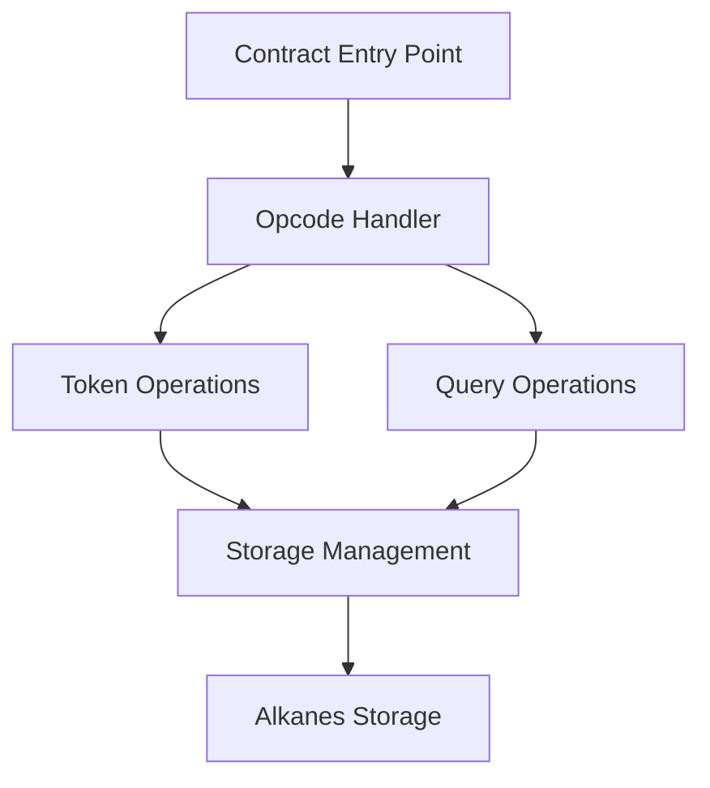
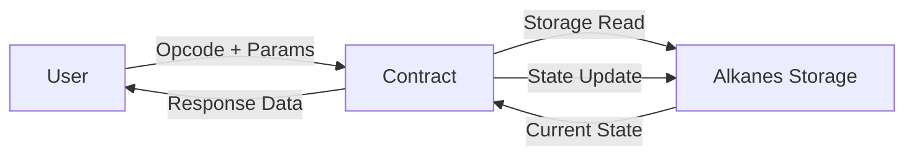
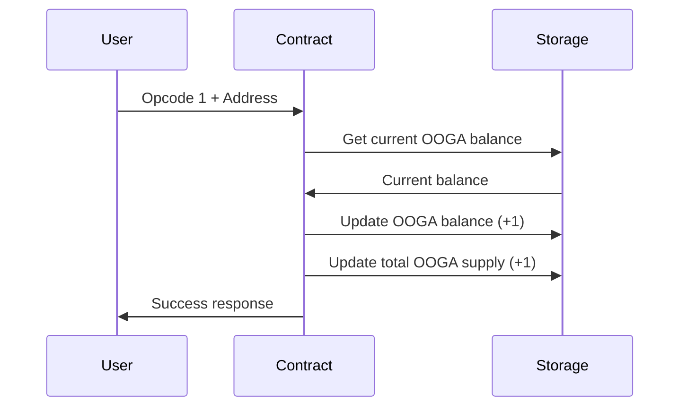
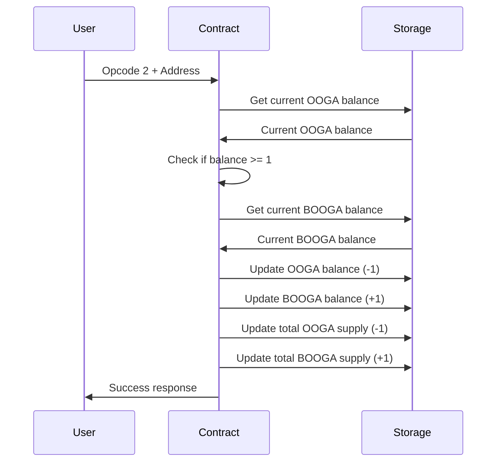

# OOGA BOOGA System Patterns

## Contract Architecture

The OOGA BOOGA contract follows a standard Alkanes contract architecture with these key components:



### Core Components

1. **Contract Entry Point** (`__execute`)
   - WebAssembly export function
   - Initializes the contract instance
   - Handles memory layout for responses

2. **Opcode Handler** (in `execute` method)
   - Dispatches to appropriate functions based on opcode
   - Validates inputs
   - Constructs response objects

3. **Token Operations**
   - `claim_ooga`: Mints new OOGA tokens
   - `exchange_ooga_for_booga`: Converts OOGA to BOOGA

4. **Query Operations**
   - Balance queries for both token types
   - Total supply queries for both token types

5. **Storage Management**
   - Getters and setters for contract state
   - Storage pointers for key-value access

## Design Patterns

### 1. Storage Pointer Pattern

The contract uses the Storage Pointer pattern to abstract key-value storage access:

```rust
pub fn ooga_balance_pointer(&self, address: &str) -> StoragePointer {
    StoragePointer::from_keyword(&format!("/ooga-balance/{}", address))
}
```

This pattern:
- Centralizes storage key definitions
- Provides type safety for storage operations
- Simplifies storage access throughout the contract

### 2. Numeric Opcode Pattern

The contract uses numeric opcodes (0-6) to dispatch different operations:

```rust
match shift_or_err(&mut inputs)? {
    0 => { /* Initialize contract */ },
    1 => { /* Claim OOGA */ },
    // ...
}
```

This pattern:
- Provides a simple interface for external callers
- Enables efficient dispatch of operations
- Follows Alkanes platform conventions

### 3. Forward Response Pattern

The contract uses the Forward Response pattern to handle incoming Alkanes:

```rust
let mut response = CallResponse::forward(&context.incoming_alkanes);
```

This pattern:
- Ensures proper handling of any Alkanes sent to the contract
- Maintains the flow of assets through the contract
- Simplifies response construction

### 4. Checked Arithmetic Pattern

The contract uses checked arithmetic to prevent overflows:

```rust
let new_balance = current_balance.checked_add(1)
    .ok_or_else(|| anyhow!("balance overflow"))?;
```

This pattern:
- Prevents arithmetic overflows that could lead to security issues
- Provides clear error messages for arithmetic failures
- Follows Rust best practices for safe numeric operations

## Data Flow



### Token Claiming Flow



### Token Exchange Flow



## Error Handling

The contract uses Rust's `Result` type with `anyhow` for error handling:

```rust
fn claim_ooga(&self, address: &str) -> Result<()> {
    // ...
    .ok_or_else(|| anyhow!("balance overflow"))?;
    // ...
}
```

This approach:
- Provides clear error messages
- Enables proper error propagation
- Follows Rust idioms for error handling

## Optimization Patterns

The contract is optimized for WebAssembly deployment:

1. **Minimal State Changes**
   - Only updates the specific storage keys that need to change

2. **Efficient Storage Keys**
   - Uses short, consistent storage key formats

3. **No Dynamic Allocation**
   - Avoids unnecessary memory allocation in critical paths

4. **Build Optimizations**
   - Uses Rust's release profile optimizations
   - Applies WASM-specific optimizations via build.rs
   - Compresses the final binary with gzip level 9
